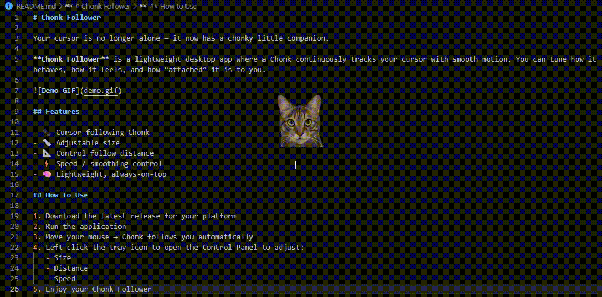

# Chonk Follower

Your cursor is no longer alone — it now has a chonky little companion.

**Chonk Follower** is a lightweight desktop app where a Chonk continuously tracks your cursor with smooth motion. You can tune how it behaves, how it feels, and how “attached” it is to you.

## Features

- 🐾 Cursor-following Chonk
- 📏 Adjustable size
- 📐 Control follow distance
- ⚡ Speed / smoothing control
- 🧠 Lightweight, always-on-top

## How to Use

1. Download the latest release for your platform
2. Run the application
3. Move your mouse → Chonk follows you automatically
4. Left-click the tray icon to open the Control Panel to adjust:
   - Size
   - Distance
   - Speed
5. Enjoy your Chonk Follower